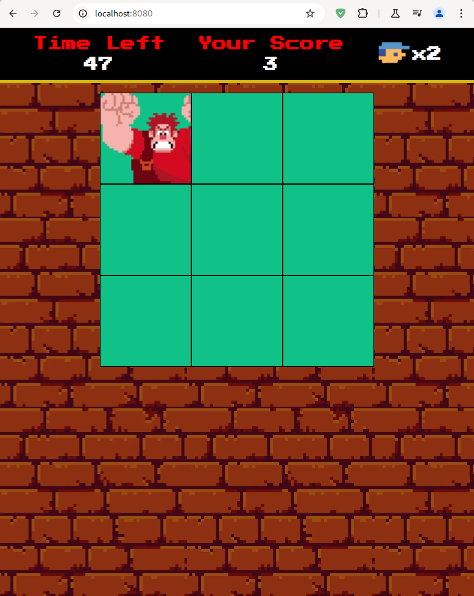

<h1>
    <a href="https://www.dio.me/">
     </a>
    <span> Formação Docker Fundamentals
</span>
</h1>

# :computer: Desafio de projeto: Criando um Container de uma Aplicação WEB

Neste projeto o expert utilizou o Docker Compose para executar uma aplicação HTML em um Container Apache. Você poderá ir além e fazer alterações mais robustas ao seu projeto, estilizando sua página e utilizando seus conhecimentos em (HTML, CSS e JS). Você também pode buscar outras formas para executar seu arquivo HTML em outras Linguagens de Programação.

## PASSO A PASSO:

1. Criar um arquivo YML com as definições de um servidor Apache (httpd); 
2. Especificar no arquivo YML o local onde os arquivos da aplicação estarão. A aplicação pode ser um simples Hello World. Será que você consegue executar uma aplicação web completa? 
3. Subir o arquivo YML e a aplicação para um repositório no GitHub. 

# :bulb: Solução do desafio 

Para esse desafio utilizei um container com a imagem do nginx como servidor http ao invés do apache.

Configuração do arquivo **.yml**

```yml
version: '3.9'
services:
  nginx:
    image: nginx:1-alpine
    container_name: nginx-app
    ports: 
      - 8080:80
    volumes: 
      - ./website:/usr/share/nginx/html
```

Para os arquivos do site utilizei um [projeto de um jogo](https://github.com/tsdes-santiago/DIO_RiHappyFrontEnd/tree/main/DetonaRalph) em HTML, CSS e Javascript, o qual foi executado corretamente no localhost.

